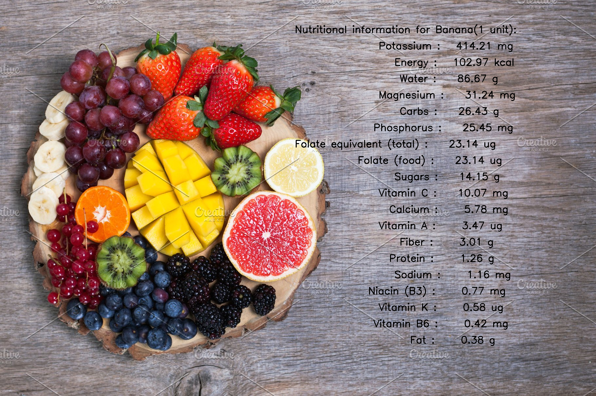

# Know Your Food

Food is any nutritious substance that people eat/drink in order to maintain life and growth. But due to various reasons, almost every country in the world is facing the problem of an unhealthy/unbalanced diet among its people. Based on a World Health Organization's (WHO) [study](https://www.who.int/gho/ncd/risk_factors/unhealthy_diet_text/en/), approximately 1.7 million of deaths worldwide were attributable to low fruit and vegetable consumption in 2008. This makes one thing clear: nearly every global diet needs to change somehow. Despite the many challenges in studying nutrition, we already know what constitutes a healthy diet - Less processed foods and more fruits, vegetables, and whole grains.  
Sometimes the inaccessibility of nutrition information plays a role in people's choice of food items. This project aims to provide this information in the click of an image so people are more aware of what constitutes their diet and choose their food more responsibly based on their dietary needs.   
Please note that in this demo we have built a model that is capable of identifying a single fruit/vegetable  in an image (totally the model can identify 120 different fruits and vegetables) and thus is not exhaustive. The project can be extended to cover all possible food items such as dairy, meat, etc.

## Getting Started
These instructions will get you a copy of the project up and running on your local machine for development and testing purposes. 

### Prerequisites
1) PyTorch & TorchVision
2) Intel OpenVINO Toolkit
3) Python Imaging Library (PIL)

### Dataset and API
The dataset available in this [link](https://www.kaggle.com/moltean/fruits) on kaggle was used to build the model to classify fruits and vegetables. On the basis of the classification, its nutritional information will be retrieved in real time by calling a nutritional database [API](https://www.edamam.com/).  

For inference, this model makes use of Intel OpenVINO library which will be used to deploy it at the edge.

### Running the tests
The test can be run from the root directory in command line.   
**Example**:  
`python src/app.py -m models/fruits.xml -i inputs/banana.jpg -id <app_id> -k <app_key>`   
* **`-m`** refers to the path of the model that will be making the classification of the fruit/vegetable -__optional__ (_else default value will be used)_   
* **`-i`**  refers to the path of the input file i.e., the fruit/vegetable to check for nutritional information - __required__
* **`-id`** App Id required for calling the API - __optional__
* **`-k`** App Key required for calling the API for authentication purposes - __optional__

#### Other optional arguments
* **`-c`** file location of CPU extension, if using CPU (_not required_ for OpenVINO Version>=2020.x)
* **`-d`** intel hardware used if not CPU (GPU, FPGA, MYRIAD)

__Note:__ A call to the API will be only made if `app_id` and `app_key` are provided else a stubbed output will be shown.

### Output
The nutritional information displayed on top of the image:

### Scope for extension/Future Work
+ Identify multiple food items present in an input image and display the combined nutritional information
+ Recipe Recommendation - suggest food recipes to people as they click an image. This comes in handy when shopping at a supermarket to choose relevant ingredients
+ Suggest healthy alternatives to the food item in the input

### Authors
1) Lakshya Malhotra
2) Vijaya Lakshmi Venkatraman
