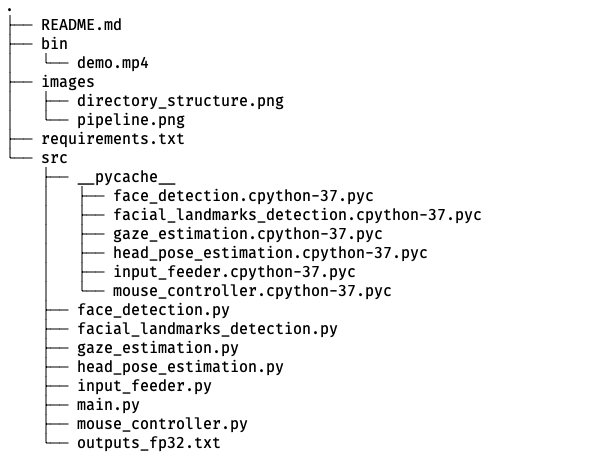

# Computer Pointer Controller
This project is the part of Intel Edge AI for IoT developers nanodegree of Udacity. It 
uses a person's gaze to control the mouse pointer to move in that direction. It can be used on a live video feed from webcam or a video stream. The project itself uses 4 different models and Gaze detection is one of the models which lies on the top of the model stack.

## Project Set Up and Installation
*TODO:* Explain the setup procedures to run your project. For instance, this can include your project directory structure, the models you need to download and where to place them etc. Also include details about how to install the dependencies your project requires.

### Set up locally
Following is the step-by-step instructions to run the application:
1. Download and install __Intel OpenVINO toolkit__. The detailed instructons for installation can be 
found [here](https://docs.openvinotoolkit.org/latest/index.html)
2. Create a virtual environment using either [anaconda](https://docs.conda.io/projects/conda/en/latest/user-guide/tasks/manage-environments.html#creating-an-environment-with-commands) or [virtualenv](https://docs.python.org/3/library/venv.html#creating-virtual-environments)
3. Source the OpenVINO environment using: `source /opt/intel/openvino_2020.2.117/bin/setupvars.sh -pyver 3.7` where the flag `pyver` is optional (needs python version 3.5+ and preferably openvino version 2020.x.xxx)
4. Download all the starter files. These can be downloaded from [here](https://video.udacity-data.com/topher/2020/April/5e974e37_starter/starter.zip). Once downloaded, unzip the files in the project directory
5. Download the required models from OpenVINO model zoo. The models we will be using are:
    * [Face Detection](https://docs.openvinotoolkit.org/latest/omz_models_intel_face_detection_adas_binary_0001_description_face_detection_adas_binary_0001.html)
    * [Facial Landmarks Detection](https://docs.openvinotoolkit.org/latest/_models_intel_landmarks_regression_retail_0009_description_landmarks_regression_retail_0009.html)
    * [Head Pose Estimation](https://docs.openvinotoolkit.org/latest/_models_intel_head_pose_estimation_adas_0001_description_head_pose_estimation_adas_0001.html)
    * [Gaze Estimation](https://docs.openvinotoolkit.org/latest/_models_intel_gaze_estimation_adas_0002_description_gaze_estimation_adas_0002.html)

(Downloading the models from command line for different precision values is discussed in the next section.)

6. Once the models are downloaded, we need to create python scripts for each of the four models for preprocessing and making inferences. This is because each model has different set of requirements. These scripts are listed in [src](src/) directory.
The entire directory structure for the project is like this:


- `images` (_dir_): contains all the project metadata like the images
- `bin` (_dir_): contains the video file `demo.mp4` on which the application is run
- `requirements.txt`(_file_): file containing list of the important packages required for running this project
- `src`(_dir_): contains all the source code for this project
    - `face_detection.py`: contains `FaceDetection` class which has methods for loading the face detection model, preprocessing the inputs, making inferences and processing the outputs which are the face images of person
    - `facial_landmarks_detection.py`: this script contains `FacialLandmarksModel` class which uses the output from `face_detection.py` script as input, loads the landmark detection model, makes inferences and finally processes the outputs. It outputs the coordinates and the images of left and right eyes of person in the video frame
    - `head_pose_estimation.py`: similar to `facial_landmarks_detection.py`, this script also uses the output of face detection model as input and outputs three angles - yaw, pitch and roll which constitutes the head position of the person in video frame
    - `gaze_estimation.py`: for the purpose of running this script, we had to run all above scripts since it takes person's eyes and head poses as inputs. It then outputs the gaze vector of the person from which the _x_ and _y_ coordinates for mouse pointer can be extracted
    - `input_feeder.py`: it initializes the videocapture with appropriate input ("CAM", video or image) and then start the pipeline by returning the frames in batches for inferencing
    - `mouse_controller.py`: contains class for controlling the mouse pointer
    - `main.py`: the main script which wraps all the above modules together and runs the application

## Demo
*TODO:* Explain how to run a basic demo of your model.
### Downloading the pre-trained models
- Activate the environment for the project
- Do `source /opt/intel/openvino_2020.2.117/bin/setupvars.sh -pyver 3.7` 
- Change the directory to:
`cd /opt/intel/openvino/deployment_tools/tools/model_downloader`
- __For Face Detection model, run the following python script with the given flags:__
```
python downloader.py --name face-detection-adas-binary-0001 -o <path_to_the_project_directory>

or 

python downloader.py --name face-detection-adas-0001 -o <path_to_the_project_directory>
```
flag `-o` refers to the path where the model should be downloaded.

> __`face-detection-adas-binary-0001` model is available in only one precision (FP32), so I used `face-detection-adas-0001` model which offers (FP32, FP16, INT8) precision values. Different precision values are needed for benchmarking the models. I double checked and both the models performed exactly the same.__

- __Facial landmarks detection model__
```
python downloader.py --name landmarks-regression-retail-0009 -o <path_to_the_project_directory>
```
- __Head pose estimation model__
```
python downloader.py --name head-pose-estimation-adas-0001 -o <path_to_the_project_directory>
```
- __Gaze estimation model__
```
python downloader.py --name gaze-estimation-adas-0002 -o <path_to_the_project_directory>
```
- __Running Application__

To run the application, execute the following command from the root directory
```
python src/main.py --input_path bin/demo.mp4 --face_detection $MODEL_DIR/face-detection-adas-binary-0001/FP32-INT1/face-detection-adas-binary-0001 --facial_landmarks $MODEL_DIR/landmarks-regression-retail-0009/FP32/landmarks-regression-retail-0009 --head_pose $MODEL_DIR/head-pose-estimation-adas-0001/FP32/head-pose-estimation-adas-0001 --gaze $MODEL_DIR/gaze-estimation-adas-0002/FP32/gaze-estimation-adas-0002 --visualize fd fld hpe --device CPU
```

## Documentation
*TODO:* Include any documentation that users might need to better understand your project code. For instance, this is a good place to explain the command line arguments that your project supports.

__Description of various command line arguments and shell variables used:__
- `MODEL_DIR` is the path to the directory which contains all the models
- `--input_path`: path to the input file or "CAM" for webcam
- `--face_detection`: path to face detection model
- `--facial_landmarks`: path to facial landmarks detection model
- `--head_pose`: path to head pose estimation model
- `--gaze`: path to gaze estimation model
- `--visualize`: flag for outputting the video with given bounding boxes based on the arguments parsed: 
    * `fd`: bounding box only around the face of the person
    * `fld`: bounding boxes around both the eyes of the person
    * `hpe`: diplays the three head pose angles on the frame
    
    (_Combination of these arguments can also be used_)
- `--device`: flag parses the device name on which inference is being run. Default device is "CPU", other devices like "GPU", "FPGA", "MYRIAD" can also be passed.

(_Note: OpenVINO version 2020.x.xxx does not require any cpu extension files_)

### Project Pipeline
The overall flow of data through the model looks like:


## Benchmarks
*TODO:* Include the benchmark results of running your model on multiple hardwares and multiple model precisions. Your benchmarks can include: model loading time, input/output processing time, model inference time etc.

## Results
*TODO:* Discuss the benchmark results and explain why you are getting the results you are getting. For instance, explain why there is difference in inference time for FP32, FP16 and INT8 models.

## Stand Out Suggestions
This is where you can provide information about the stand out suggestions that you have attempted.

### Async Inference
If you have used Async Inference in your code, benchmark the results and explain its effects on power and performance of your project.

### Edge Cases
There will be certain situations that will break your inference flow. For instance, lighting changes or multiple people in the frame. Explain some of the edge cases you encountered in your project and how you solved them to make your project more robust.
