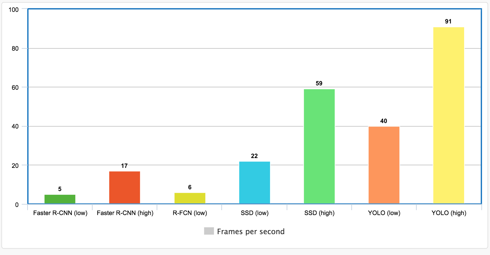

# Project Write-Up

This write up contains the details about the project. It includes the motivation for selecting a particlular model and the comparisons of the original model and it's converted intermediate representation (IR) using OpenVINO. We compare the size, accuracy and the inference time of both original model and the converted IR. Finally, we talk about the use cases of model and why these use cases would be useful in terms of the possible applications.

## Selecting Model
All of the models that were tried for people detection were provided by [Tensorflow detection model zoo](https://github.com/tensorflow/models/blob/master/research/object_detection/g3doc/detection_model_zoo.md). The following models have been tried for the people counter-app:
1. **[`ssd_mobilenet_v2_coco_2018_03_29`](http://download.tensorflow.org/models/object_detection/ssd_mobilenet_v2_coco_2018_03_29.tar.gz):** `ssd_mobile_v2_coco` is a light weight model with high inference speed and relatively lower [COCO mAP](https://github.com/tensorflow/models/blob/master/research/object_detection/g3doc/detection_model_zoo.md#coco-trained-models) score (*higher is better*). The IR of `ssd_mobilenet_v2_coco` makes inference with low latency and maintain high frame rate of the output video (if the inference is performed on a video). However, the model suffered a lot of false negatives where the frames just dropped and it gives an incorrect number of total count of people.

2. **[`faster_rcnn_inception_v2_coco_2018_01_28`](http://download.tensorflow.org/models/object_detection/faster_rcnn_inception_v2_coco_2018_01_28.tar.gz):** `faster_rcnn_inception_v2_coco` is one of the state of the art object detection models built on the top of inception neural networks architecture. This model offers higher [COCO mAP](https://github.com/tensorflow/models/blob/master/research/object_detection/g3doc/detection_model_zoo.md#coco-trained-models) score but with comparatively lower inference speeds. Although, the IR of this model did not suffer from the false negatives as `ssd_mobilenet_v2_coco` did, it had a really low frame rate when inference is performed on a video owing to it's large size.

Here is a comparison of the output frame rate for various models (_the comparison is done on the original models not on the IR of the corresponding model_):


(Source: [Jonathan Hui](https://medium.com/@jonathan_hui/object-detection-speed-and-accuracy-comparison-faster-r-cnn-r-fcn-ssd-and-yolo-5425656ae359))

The above two models can be downloaded from the terminal using the following command:
```bash
wget http://download.tensorflow.org/models/object_detection/<model_name>.tar.gz
```
The downloaded model can then be extracted from the `tar` file using:
```bash
tar -xvf <model_name>.tar.gz
```

After the model has been extracted, we need to find the `frozen_inference_graph.pb` and `pipeline.config` files. These files are required to create the IR using the model optimizer of Intel OpenVINO toolkit.

## Explaining Custom Layers
Each layer in both of the models are supported by the model optimizer. So we don't have to create custom layers. After checking for unsupported layers, we can create the Intermediate representation (IR) of each of the model by model optimizer using the command (*showing the command for `faster_rcnn`*) inside the `faster_rcnn` directory:
```
python /opt/intel/openvino/deployment_tools/model_optimizer/mo_tf.py --input_model frozen_inference_graph.pb --tensorflow_object_detection_api_pipeline_config pipeline.config --reverse_input_channels --tensorflow_use_custom_operations_config /opt/intel/openvino/deployment_tools/model_optimizer/extensions/front/tf/faster_rcnn_support.json
```
This creates an IR for the model which consists of two files:
- `frozen_inference_graph.xml`: contains the information about model architecture
- `frozen_inference_graph.bin`: contains the model weights

These files are needed to create what is known as `executable_network` using which the inferences are made.

## Comparing Model Performance
The inference can be run using the following:

__Udacity's workspace:__

First activate the environment using:
```
source /opt/intel/openvino_2019.3.376/bin/setupvars.sh -pyver 3.5
```
Then, run:
```
python main.py -i resources/Pedestrian_Detect_2_1_1.mp4 -m ssd_mobilenet_v2_coco_2018_03_29/frozen_inference_graph.xml -l /opt/intel/openvino/deployment_tools/inference_engine/lib/intel64/libcpu_extension_sse4.so -d CPU -pt 0.3 | ffmpeg -v warning -f rawvideo -pixel_format bgr24 -video_size 768x432 -framerate 24 -i - http://0.0.0.0:3004/fac.ffm
```

__Running locally (Mac):__
Activate the environment using:
```
source /opt/intel/openvino_2019.3.376/bin/setupvars.sh -pyver 3.5
```
Then, run:
```
python main.py -i resources/Pedestrian_Detect_2_1_1.mp4 -m ssd_mobilenet_v2_coco_2018_03_29/frozen_inference_graph.xml -d CPU -l /opt/intel/openvino_2019.3.376/deployment_tools/inference_engine/lib/intel64/libcpu_extension.dylib -pt 0.3 | ffmpeg -v warning -f rawvideo -pixel_format bgr24 -video_size 768x432 -framerate 24 -i - http://0.0.0.0:3004/fac.ffm
```
For comparing the model performance, we compared the original and the IR versions of `ssd_mobilenet_v2_coco` and `faster_rcnn_inception_v2_coco` models. The performance metrics used were accuracy, inference time, and the size of the model. 

### Accuracy:
Although we didn't expect the accuracy to change very much, it's still an important metric for model performance. We usually see that the IR performs almost the same or worse than the actual model because of the optimization techniques employed by model optimizer like quantization and layer fusion. This loss in accuracy is usualy compensated by faster inference and smaller size models.

**SSD model:**
- As pointed before, `ssd_mobilenet` model performed worse than `faster_rcnn`. It had a lot of false positives (it was not detecting the person even if he is still in the frame). This will increase the `total_count` and decrease the `average duration` in the app and hence giving incorrect stats. 
- This could be prevented to some extent by two ways: lower the probability threshold and a technique suggested in [this post](https://knowledge.udacity.com/questions/153916)
- I used `-pt=0.3` and `missing_frame_threshold=30` and it gave `total_count=7` at the end of stream which is within $\pm 1$ range of the expected result

**Faster RCNN model:**
- Apart from extremely slow frame rate, `faster_rcnn` model performed really well and didn't show any false negatives
- I used `-pt=0.45` and `missing_frame_threshold=5` and it gave a `total_count=6` which indeed is the actual number of total people in the video

### Inference speed:
Average inference time for each model:

| Model | Environment | IR (ms) | Original (ms) |
| --- | --- | --- | --- | 
| SSD Mobilenet | Mac 5th gen core-i7 | 35 | 94 |
| SSD Mobilenet | Udacity workspace | 71 | N/A |
| Faster RCNN | Mac 5th gen core-i7 | 440 | 754 |
| Faster RCNN | Udacity workspace | 940 | N/A |

### Size:
Size of the model protobuf and IR files for FP32 precision:

| Model | Original (`.pb`) | IR (`.xml`) | IR (`.bin`) |
| --- | --- | --- | --- |
| SSD Mobilenet | 70 MB | 112 KB | 67 MB |
| Faster RCNN | 57 MB | 126 KB | 53 MB |

## Assess Model Use Cases

Some of the potential use cases of the people counter app are places like banks, hospitals etc. For example, if only a certain number of people are allowed in a bank at a given time this app can track the number of people and can be used for survellience applications. Similarly, in places like ICU in hospitals where only a certain number of people are allowed for a fixed time, this app can be useful. 

Another potential application of this can be in self-driving cars for detecting pedestrians, though, this would require a even more robust network (*no false negatives*) with even high inference speeds as well as high end hardware (GPU).


## Assess Effects on End User Needs

Lighting, model accuracy, and camera focal length/image size have different effects on a
deployed edge model. All of these metrics effect the inference performance of the model a lot. Say for example, for self-driving cars, we need to have video feeds in all kind of lighting whether it is day or night or cloudy so that the model accuracy is not dependent on the environmental conditions. Similarly, the image/video resolution, camera angle also helps in capturing details and augment the subject in the frame in many ways. This will certainly effect the model accuracy and performance.

## References
- https://github.com/tensorflow/models/blob/master/research/object_detection/object_detection_tutorial.ipynb
- https://github.com/VimalsCode/PeopleCounterApp
- https://answers.opencv.org/question/80580/how-to-record-the-time-of-stay-by-detected-people-in-a-video/
